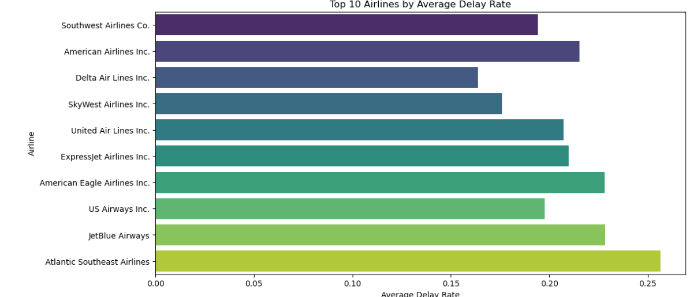

# Airline Delay Analysis (2003–2022)

---

## Project Overview

This project analyzes U.S. domestic airline delays over almost two decades. Using **Python** and **SQL**, we clean, explore, and aggregate airline and airport delay data to provide actionable insights.

**Main Goals:**
- Identify airlines and airports with high delay rates
- Understand seasonal and yearly delay trends
- Analyze causes of delays (carrier, weather, NAS, security, late aircraft)

---

## Key Insights

### Airlines with Highest Delay Rates

| Airline                        | Avg Delay Rate | Avg Delay Minutes | Dominant Delay Cause       |
|--------------------------------|----------------|-----------------|---------------------------|
| Atlantic Southeast Airlines     | 24.4%          | 54 min          | NAS / Air Traffic         |
| JetBlue Airways                 | 23.6%          | 59 min          | Late Aircraft             |
| Allegiant Air                   | 22.6%          | 60 min          | Late Aircraft             |

### Airports with Longest Delays

| Airport                                       | Avg Delay Rate | Avg Delay Minutes |
|-----------------------------------------------|----------------|-----------------|
| Youngstown/Warren, OH                         | 100%           | 59.5             |
| Pinehurst/Southern Pines, NC                  | 41.9%          | 52.3             |
| Topeka, KS                                    | 36.5%          | 61.2             |
| Newark, NJ                                    | 28.1%          | 65.6             |

### Seasonal Delay Patterns

| Season | Avg Delay Rate |
|--------|----------------|
| Summer | 22.7%          |
| Winter | 21.9%          |
| Spring | 18.3%          |
| Fall   | 16.1%          |

### Yearly Trend Highlights
- Peak delays: 2006–2007 (~25%)
- COVID impact: 2020 (~9.6%)
- Post-pandemic return: 2021–2022 (~17–21%)

### Delay Causes by Airline

| Airline             | Carrier Delay % | Weather % | NAS % | Security % | Late Aircraft % |
|--------------------|----------------|-----------|-------|------------|----------------|
| Hawaiian Airlines  | 63%            | 2%        | 1.8%  | 0.4%       | 32%             |
| Aloha Airlines     | 51%            | 0.6%      | 9%    | 0.8%       | 38%             |

---

## Repository Structure

| Folder / File                              | Description                                         |
|-------------------------------------------|---------------------------------------------------|
| `Airline_Delay_Cause/`                     | Raw Kaggle dataset (`Airline_Delay_Cause.csv`)   |
| `Understanding Airline_Delay_Cause/`      | Word document explaining the raw dataset         |
| `data/Airline_Delay_Cleaned.csv`          | Cleaned dataset for Python EDA                   |
| `data/Airline_Delay_Production_Ready.csv` | Production-ready CSV for SQL analysis            |
| `data_cleaning/`                           | Python notebook: step-by-step data cleaning      |
| `EDA/`                                     | Python notebooks + Word doc: exploratory analysis|
| `SQL_Analysis/`                            | SQL scripts + Word doc: aggregated analysis      |
| `Database_Table_Create/`                   | SQL scripts to create tables for production data |

---

## Tools & Technologies

- **Python:** Pandas, Matplotlib, Seaborn  
- **PostgreSQL / PGAdmin:** SQL aggregation queries  
- **Jupyter Notebook:** Interactive workflow and code documentation  
- **Word Documents:** Non-technical explanations of analysis  

---

## Step-by-Step Workflow

### 1. Understand the Dataset
- Columns include: `year`, `month`, carrier info, airport info, flights, delays, delay causes, total delay minutes, derived metrics (`delay_rate`, `avg_delay_per_delayed_flight`, `season`).

### 2. Data Cleaning (Python)
- Renamed columns for clarity
- Handled missing/null values
- Added derived metrics for analysis

### 3. Exploratory Data Analysis (Python)
- Top airlines and airports by delay rate and minutes
- Seasonal & yearly trends
- Visualizations: bar charts, line plots

### 4. SQL Analysis (PostgreSQL)
- Aggregated airline and airport delays
- Analyzed delay causes
- Calculated delay rates and percentages

---

## Insights & Recommendations

- **Airlines:** Focus on carrier-related and late aircraft delays  
- **Airports:** Optimize operations for high-traffic hubs  
- **Seasonal Planning:** Summer and Winter require special attention  

---

## Visualizations

**1. Top Airports by Average Delay Rate**  

**2. Average Delay Rate by Season**  

**3. Average Delay Rate over Time**  

**4. Average Contribution to Total Delay**  

**5. Average Delay Rate (All Airlines)**  

---

