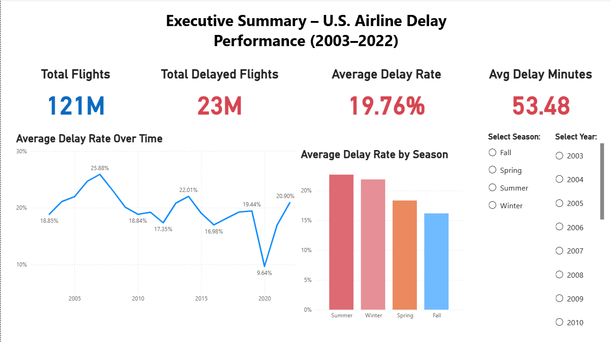
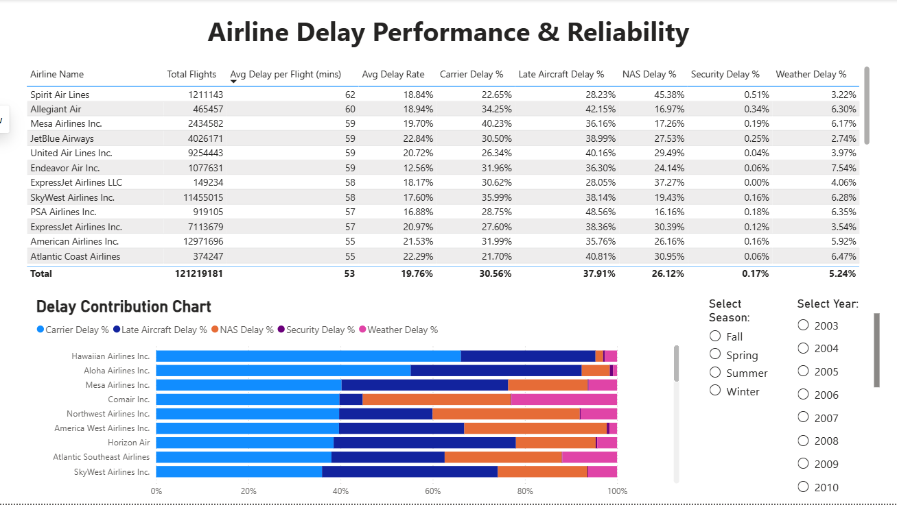
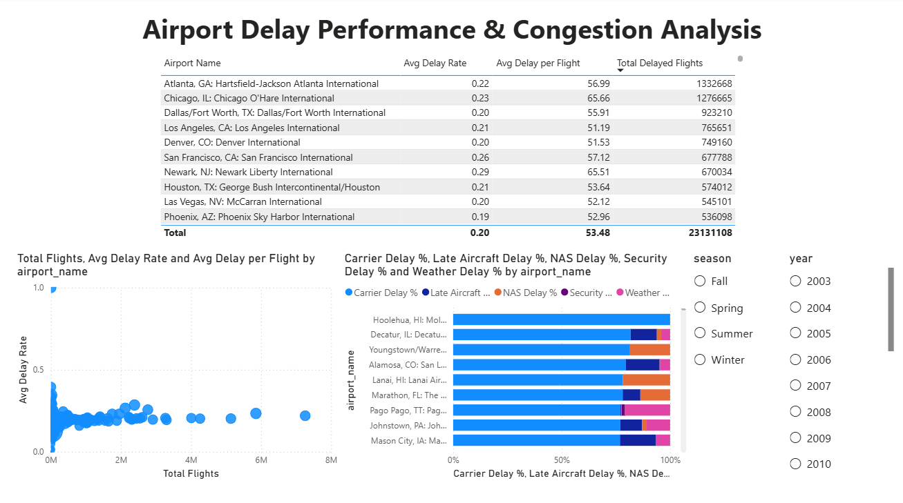
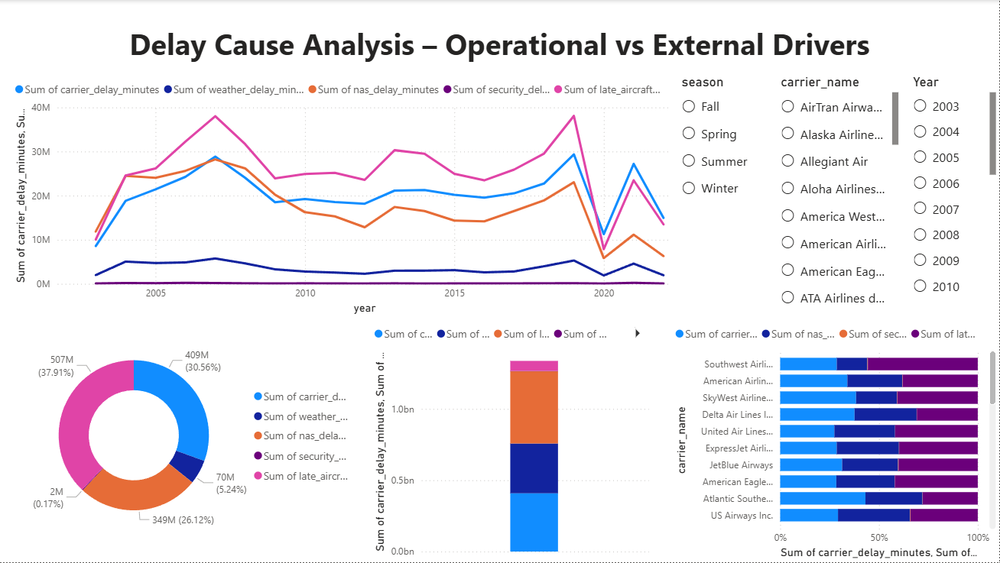
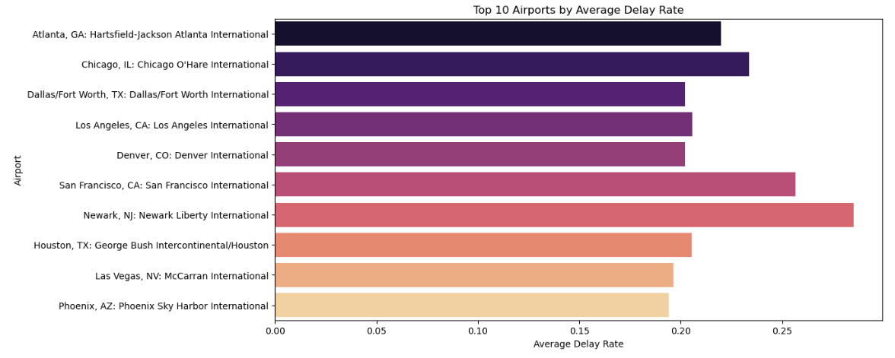
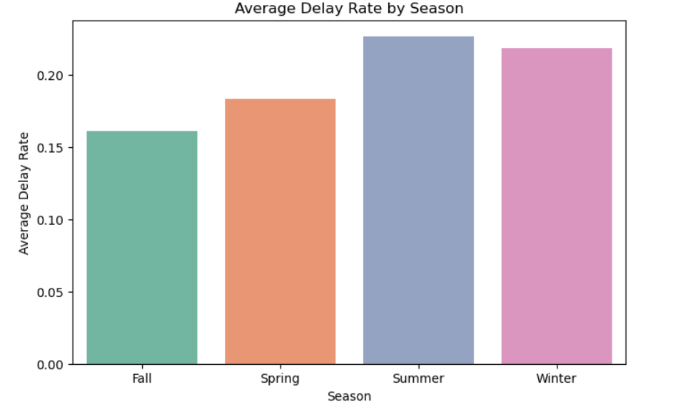
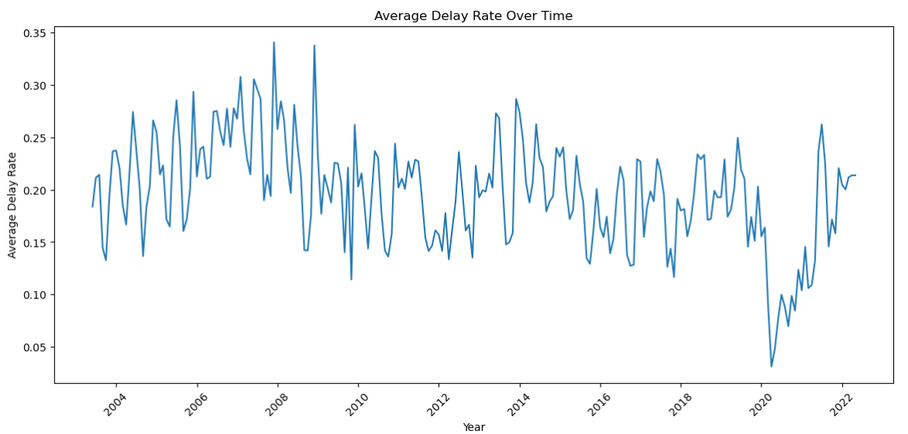
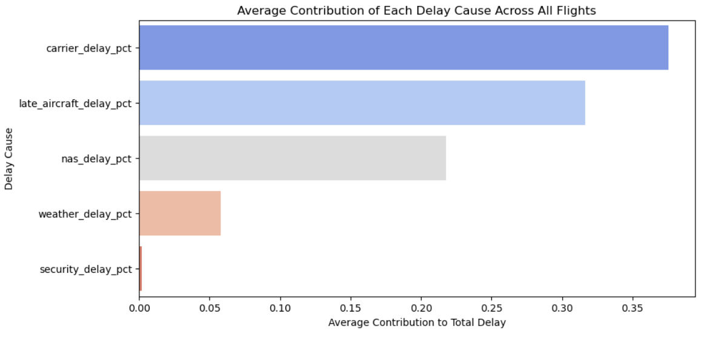

# Airline Delay Analysis (2003–2022)

---

## Project Overview

This project analyzes **U.S. domestic airline delays** from 2003 to 2022. The goal is to understand **patterns, trends, and causes of flight delays** across airlines, airports, seasons, and years using **Python** for exploratory analysis and **SQL** for aggregated, production-ready analytics.

The dataset used includes both raw and cleaned production-ready versions, covering:

- **Flight details:** total flights, delayed flights, canceled/diverted flights  
- **Delay types:** carrier, weather, NAS (National Airspace System), security, late aircraft  
- **Airline and airport info:** codes, names  
- **Derived metrics:** delay rate, average delay per delayed flight, delay percentages  

**Key Objectives:**

1. Identify airlines and airports with **highest delay rates**  
2. Understand **seasonal and yearly trends** in delays  
3. Determine **primary causes** of delays  
4. Provide actionable insights for **airline operations and airport management**

---

## Dashboard Preview

Here are snapshots of the PowerBI dashboard pages, showing executive and performance-level insights:

### Executive Overview


### Airline Performance


### Airport Performance


### Delay Cause Analysis


---

## Step-by-Step Analysis Workflow

### 1. Understanding the Dataset

The dataset contains information at a **monthly level** for airlines and airports. Key columns:

- `year`, `month`: Time period of the record  
- `carrier_code`, `carrier_name`: Airline information  
- `airport_code`, `airport_name`: Airport information  
- `total_flights`, `delayed_flights_15min`, `cancelled_flights`, `diverted_flights`  
- `carrier_delay_count`, `weather_delay_count`, `nas_delay_count`, `security_delay_count`, `late_aircraft_delay_count`  
- `total_delay_minutes`, `carrier_delay_minutes`, `weather_delay_minutes`, etc.  
- Derived metrics:  
  - `delay_rate` = delayed flights ÷ total flights  
  - `avg_delay_per_delayed_flight` = total delay minutes ÷ delayed flights  
  - `% contribution to delay` by type (carrier, weather, NAS, security, late aircraft)  
  - `season` (Spring, Summer, Fall, Winter)

---

### 2. Data Cleaning (Python)

Using **Pandas**:

- **Renamed columns** for clarity  
- **Filled missing values** with meaningful replacements  
- Converted numeric columns to appropriate types  
- Added **derived metrics**: `delay_rate`, `avg_delay_per_delayed_flight`, `% contribution` columns  

Result: `Airline_Delay_Cleaned.csv` (for Python EDA) and `Airline_Delay_Production_Ready.csv` (for SQL)

---

### 3. Exploratory Data Analysis (Python)

Visual analysis included:

- **Top airlines and airports by delay rate and minutes**  
- **Seasonal trends** (Summer & Winter show higher delays)  
- **Yearly trends** (peak delays 2006–2007, COVID impact in 2020, post-pandemic recovery)  
- **Visualizations**:
  - Bar charts for top airlines/airports  
  - Line plots for trends over time  
  - Stacked bar charts for delay causes by airline  

**Key Python EDA Insights:**

- **Airlines with highest delays:** Atlantic Southeast Airlines, JetBlue Airways, Allegiant Air  
- **Airports with longest delays:** Youngstown-Warren (OH), Pinehurst/Southern Pines (NC), Topeka (KS), Newark (NJ)  
- **Seasonal delay patterns:** Summer (22.7%) > Winter (21.9%) > Spring (18.3%) > Fall (16.1%)  

---

### 4. SQL Analysis (PostgreSQL)

Performed **aggregated analysis** on the production-ready dataset:

- Calculated **total flights, total delays, avg delay rate, avg delay minutes** per airline and airport  
- Calculated **% contribution** of each delay type per airline  
- Aggregated **yearly and seasonal trends**  
- Created **production-ready tables** in PostgreSQL for reporting and dashboard usage  

**Key SQL Insights:**

- **Carrier delay is dominant** in most airlines, followed by late aircraft  
- **Weather-related delays** are minor contributors overall  
- **Yearly trends** show peak delays in 2006–2007 (~25%), lowest in 2020 (~9.6%) due to COVID  
- **Airports with high delay rates** often have fewer flights or regional operations  

---

## Visualizations

1. **Top Airports by Average Delay Rate**  


2. **Average Delay Rate by Season**  


3. **Average Delay Rate over Time**  


4. **Average Contribution to Total Delay**  


5. **Average Delay Rate (All Airlines)**  


---

## Dashboard Design Notes

- **Executive Overview:** High-level metrics and trend charts  
- **Airline Performance Page:** Table with airlines, delay rates, avg delay minutes, % contributions  
- **Airport Performance Page:** Top problematic airports, delay patterns  
- **Delay Cause Analysis:** Stacked bar charts showing contribution of carrier, weather, NAS, security, late aircraft  

**Note:** Cards with totals (like Total Flights) were removed as they were not filter-sensitive. Focus is now on **analyst-friendly tables and visualizations**.

---

## Tools & Technologies

- **Python:** Pandas, Matplotlib, Seaborn  
- **PostgreSQL / PGAdmin:** SQL aggregation queries  
- **Power BI:** Dashboard creation, interactive visualizations  
- **Jupyter Notebook:** Interactive workflow and code documentation  
- **Word Documents:** Non-technical explanation of analysis  

---

## Repository Structure

| Folder / File                              | Description                                         |
|-------------------------------------------|---------------------------------------------------|
| `Airline_Delay_Cause/`                     | Raw dataset (`Airline_Delay_Cause.csv`)          |
| `Understanding Airline_Delay_Cause/`      | Word doc explaining raw dataset                  |
| `data/Airline_Delay_Cleaned.csv`          | Cleaned dataset for Python EDA                   |
| `data/Airline_Delay_Production_Ready.csv` | Production-ready CSV for SQL analysis            |
| `data_cleaning/`                           | Python notebook: step-by-step data cleaning      |
| `EDA/`                                     | Python notebooks + Word doc: exploratory analysis|
| `SQL_Analysis/`                            | SQL scripts + Word doc: aggregated analysis      |
| `Database_Table_Create/`                   | SQL scripts to create production-ready tables    |
| `visuals/`                                 | Dashboard and EDA visualizations                 |

---

## How to Run

1. Clone the repository:  
```bash
git clone https://github.com/your-username/Airline-Delay-Analysis.git


